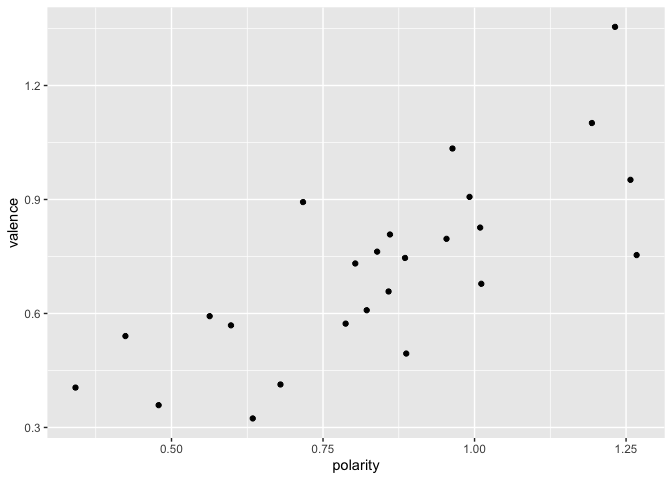

# quanteda.sentiment

<!-- badges: start -->

[](https://cran.r-project.org/package=quanteda.sentiment)
[](https://github.com/quanteda/quanteda.sentiment)
[](https://lifecycle.r-lib.org/articles/stages.html#experimental)
[](https://app.codecov.io/gh/quanteda/quanteda.sentiment?branch=master)
[](https://github.com/quanteda/quanteda.sentiment/actions/workflows/R-CMD-check.yaml)
<!-- badges: end -->

## Installation

You can install **quanteda.sentiment** from GitHub with:

``` r
remotes::install_github("quanteda/quanteda.sentiment")
```

The package is not yet on CRAN.

## About

**quanteda.sentiment** extends the **quanteda** package with functions
for computing sentiment on text. It has two main functions, for
computing two types of sentiment. These follow the structure of a
**quanteda** dictionary, which consists of *key* entries expressing the
canonical concept, and *value* patterns (such as “good”, “sad\*“, etc.)
to be matched in a text and counted as occurrences of that key.

The approach to sentiment in this package approaches sentiment
computation in two ways, depending on whether sentiment is considered a
key attribute, in which case the keys are assigned a *polarity* such as
*positive* or *negative*, or whether individual values are assigned a
*valence*, in the form of some continuous value indicating a degree of
sentiment. Each is implemented in a separate function:

- **Polarity-based sentiment.** This is implemented via
  `textstat_polarity()`, for computing a sentiment based on keys set as
  “poles” of positive versus negative sentiment. Setting polarity is
  dones through the `polarity()<-` function and can be set for any
  dictionary, for any keys. “Sentiment” here can be broadly construed as
  any contrasting pair of poles, such as “Democrat” versus “Republican”,
  for instance. More than one key can be associated with the same pole.

  Polar values are converted into sentiment scores using a flexible
  function, such as $\mathrm{log}(pos / neg)$, or
  $(pos - neg)/(pos + neg)$. **quanteda.sentiment** offers three
  built-in functions, but the user can supply any function for combining
  polarities.

- **Valence-based sentiment.** This is implemented via
  `textstat_valence()`, for computing sentiment as the average valence
  of a document’s words, based on a dictionary whose values have numeric
  valence scores. Valence scores are set using the `valence()<-`
  function. Each key in a dictionary may have values with difference
  valences.

The package comes with the following built-in dictionaries:

| Name                             | Description                                                   | Polarity | Valence |
|:---------------------------------|:--------------------------------------------------------------|:--------:|:-------:|
| data_dictionary_AFINN            | Nielsen’s (2011) ‘new ANEW’ valenced word list                |          |    ✔    |
| data_dictionary_ANEW             | Affective Norms for English Words (ANEW)                      |          |    ✔    |
| data_dictionary_geninqposneg     | Augmented General Inquirer *Positiv* and *Negativ* dictionary |    ✔     |         |
| data_dictionary_HuLiu            | Positive and negative words from Hu and Liu (2004)            |    ✔     |         |
| data_dictionary_LoughranMcDonald | Loughran and McDonald Sentiment Word Lists                    |    ✔     |         |
| data_dictionary_LSD2015          | Lexicoder Sentiment Dictionary (2015)                         |    ✔     |         |
| data_dictionary_NRC              | NRC Word-Emotion Association Lexicon                          |    ✔     |         |
| data_dictionary_Rauh             | Rauh’s German Political Sentiment Dictionary                  |    ✔     |         |
| data_dictionary_sentiws          | SentimentWortschatz (SentiWS)                                 |    ✔     |    ✔    |

## Examples

For a polarity dictionary, we can use the positive and negative key
categories from the General Inquirer dictionary:

``` r
library("quanteda.sentiment")
## Loading required package: quanteda
## Package version: 4.0.0
## Unicode version: 14.0
## ICU version: 71.1
## Parallel computing: 10 of 10 threads used.
## See https://quanteda.io for tutorials and examples.
## 
## Attaching package: 'quanteda.sentiment'
## The following object is masked from 'package:quanteda':
## 
##     data_dictionary_LSD2015

# inspect the dictionary and its polarities
print(data_dictionary_geninqposneg, max_nval = 8)
## Dictionary object with 2 key entries.
## Polarities: pos = "positive"; neg = "negative" 
## - [positive]:
##   - abide, ability, able, abound, absolve, absorbent, absorption, abundance [ ... and 1,645 more ]
## - [negative]:
##   - abandon, abandonment, abate, abdicate, abhor, abject, abnormal, abolish [ ... and 2,002 more ]

# compute sentiment
tail(data_corpus_inaugural) |>
  textstat_polarity(dictionary = data_dictionary_geninqposneg)
##       doc_id sentiment
## 1  2001-Bush 0.9233579
## 2  2005-Bush 0.9829457
## 3 2009-Obama 0.5666378
## 4 2013-Obama 0.7597420
## 5 2017-Trump 0.7724428
## 6 2021-Biden 0.6018714
```

For a valence dictionary, we can compute this for the “pleasure”
category of the Affective Norms for English Words (ANEW):

``` r
library("quanteda", warn.conflicts = FALSE, quietly = TRUE)
library("quanteda.sentiment")

# inspect the dictionary and its valences
print(data_dictionary_ANEW, max_nval = 8)
## Dictionary object with 3 key entries.
## Valences set for keys: pleasure, arousal, dominance 
## - [pleasure]:
##   - abduction, able, abortion, absent, absurd, abundance, abuse, accept [ ... and 2,463 more ]
## - [arousal]:
##   - abduction, able, abortion, absent, absurd, abundance, abuse, accept [ ... and 2,463 more ]
## - [dominance]:
##   - abduction, able, abortion, absent, absurd, abundance, abuse, accept [ ... and 2,463 more ]
lapply(valence(data_dictionary_ANEW), head, 8)
## $pleasure
## abduction      able  abortion    absent    absurd abundance     abuse    accept 
##      2.76      6.74      3.50      3.69      4.26      6.59      1.80      6.80 
## 
## $arousal
## abduction      able  abortion    absent    absurd abundance     abuse    accept 
##      5.53      4.30      5.39      4.73      4.36      5.51      6.83      5.53 
## 
## $dominance
## abduction      able  abortion    absent    absurd abundance     abuse    accept 
##      3.49      6.83      4.59      4.35      4.73      5.80      3.69      5.41

# compute the sentiment
tail(data_corpus_inaugural) |>
  textstat_valence(dictionary = data_dictionary_ANEW["pleasure"])
##       doc_id sentiment
## 1  2001-Bush  6.091330
## 2  2005-Bush  6.308839
## 3 2009-Obama  5.841437
## 4 2013-Obama  6.045129
## 5 2017-Trump  6.223944
## 6 2021-Biden  6.018528
```

We can compare two measures computed in different ways (although they
are not comparable, really, since they are different lexicons):

``` r
# ensure we have this package's version of the dictionary
data("data_dictionary_LSD2015", package = "quanteda.sentiment")

sent_pol <- tail(data_corpus_inaugural, 25) |>
  textstat_polarity(dictionary = data_dictionary_LSD2015)
sent_pol <- dplyr::mutate(sent_pol, polarity = sentiment)
sent_val <- tail(data_corpus_inaugural, 25) |>
  textstat_valence(dictionary = data_dictionary_AFINN)

library("ggplot2")

ggplot(data.frame(sent_pol, valence = sent_val$sentiment),
       aes(x = polarity, y = valence)) +
  geom_point()
```

<!-- -->

Good enough for government work!

## Where to learn more

Each dictionary and function has extensive documentation, including
references to social scientific research articles where each sentiment
concept is described in detail. There is also a package vignette with
more detailed examples.
